# Assignment 3. Responsive Web Design (Media Queries + Bootstrap Grid)

**Name:** Abilda Meiirkhan  
**Group:** IT-2503

## Part 1. Media Queries

### Task 0. Responsive Typography

- Create a simple webpage with headings and paragraphs.
- Use media queries to change font sizes for mobile, tablet, and desktop.

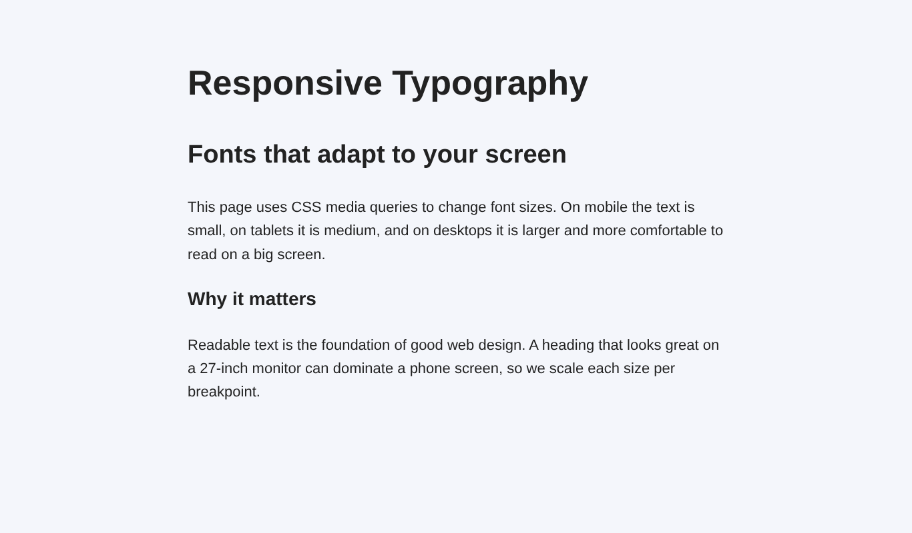

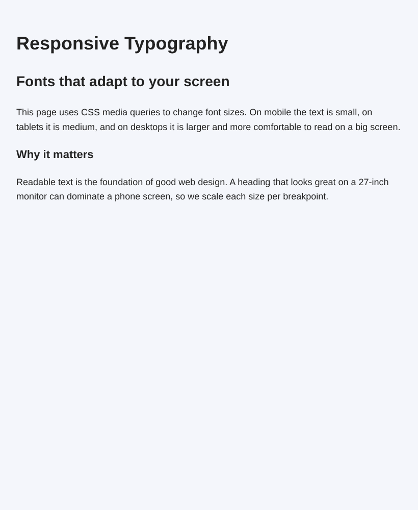

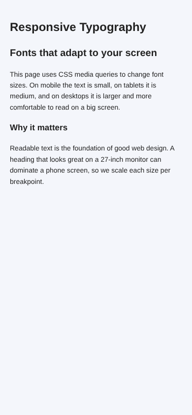

### Task 1. Responsive Layout with Media Queries

- Create a webpage with three boxes in a row.
- On desktop: display all three side by side.
- On tablet: display two boxes in a row.
- On mobile: display boxes stacked vertically.
- Use only CSS media queries (no Bootstrap).

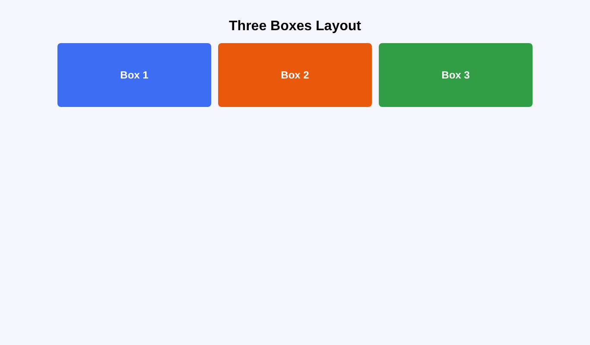

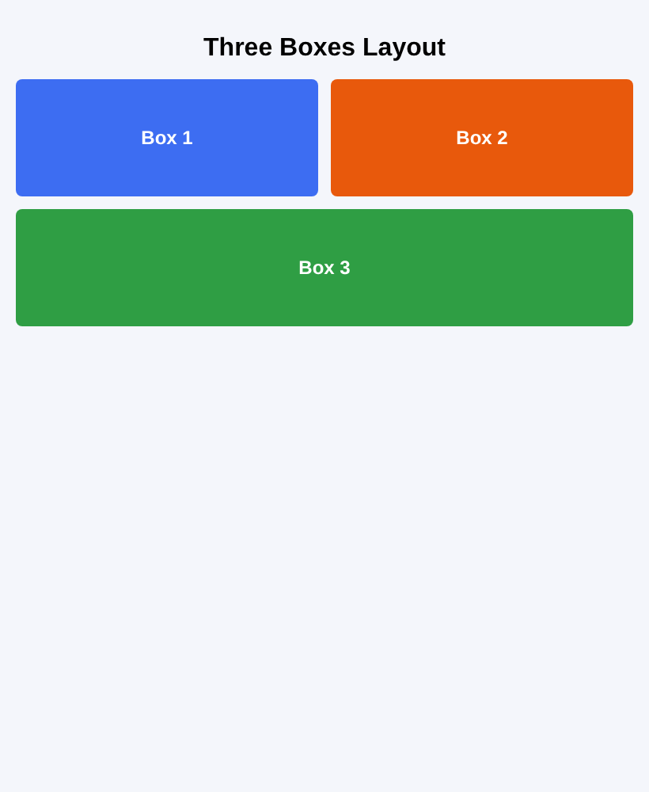

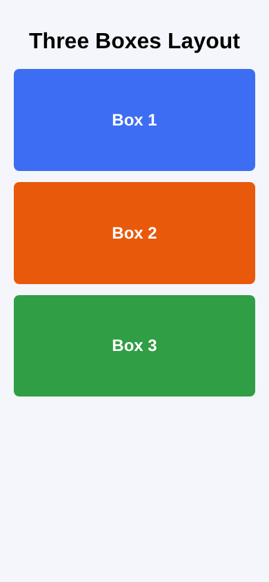

## Part 2. Bootstrap Grid System

### Task 2. Bootstrap Responsive Columns

- Build a responsive layout using Bootstrap's 12-column grid.
- Create three columns:
  - On desktop: each column takes 4 columns (3 equal parts).
  - On tablet: two columns on the first row and one on the second row.
  - On mobile: all columns stacked.

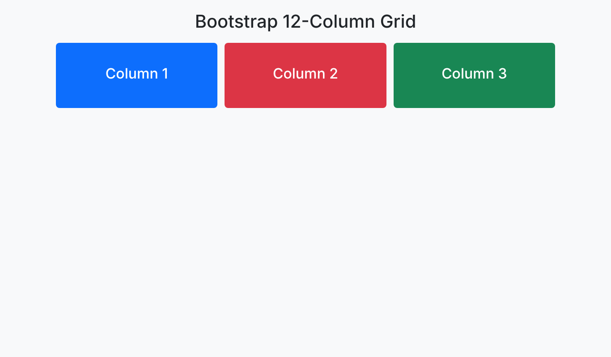

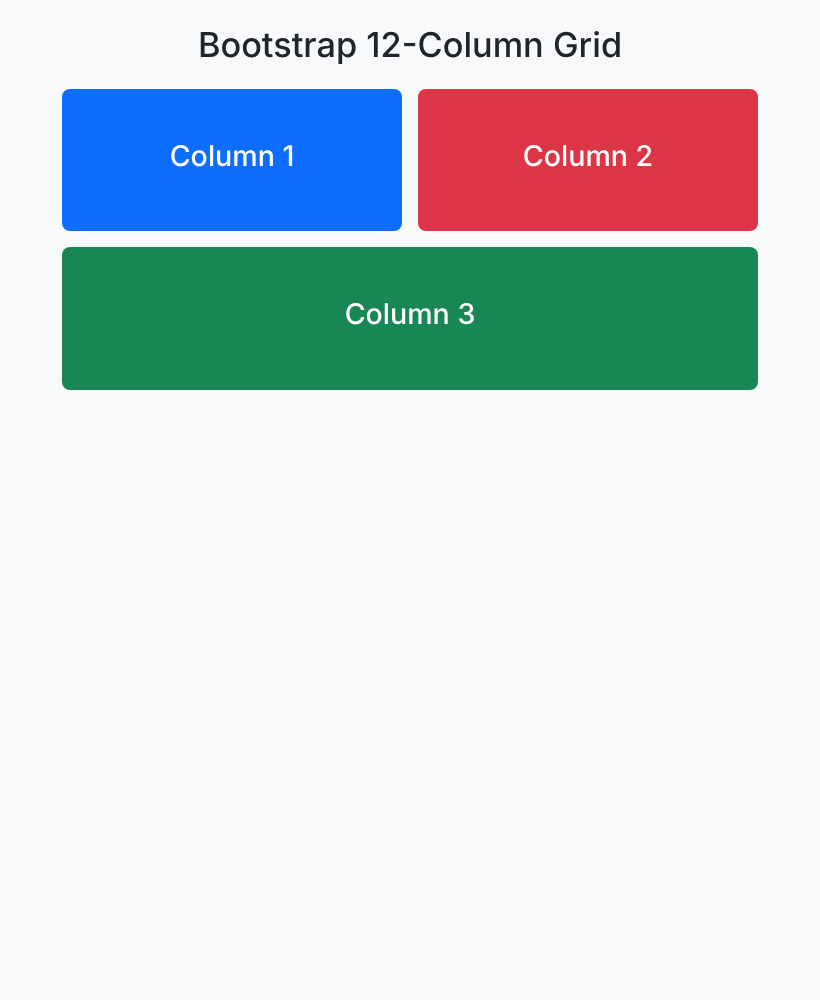

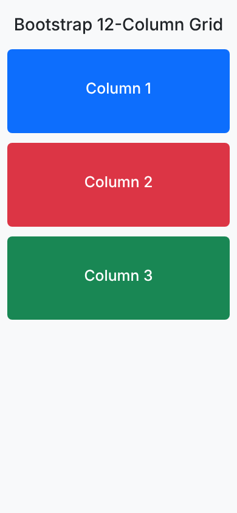

### Task 3. Bootstrap Navigation Bar

- Create a responsive navigation bar using Bootstrap components.
- It should include: a logo on the left, links on the right, and collapse into a hamburger menu on smaller screens.

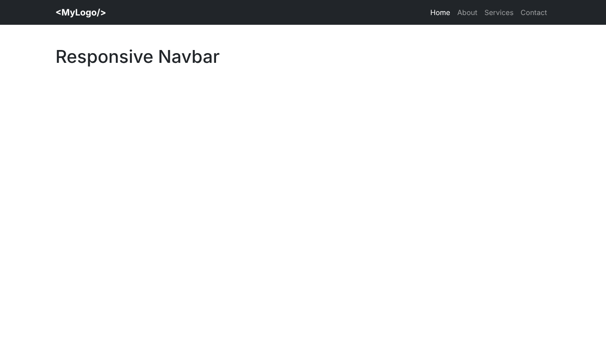

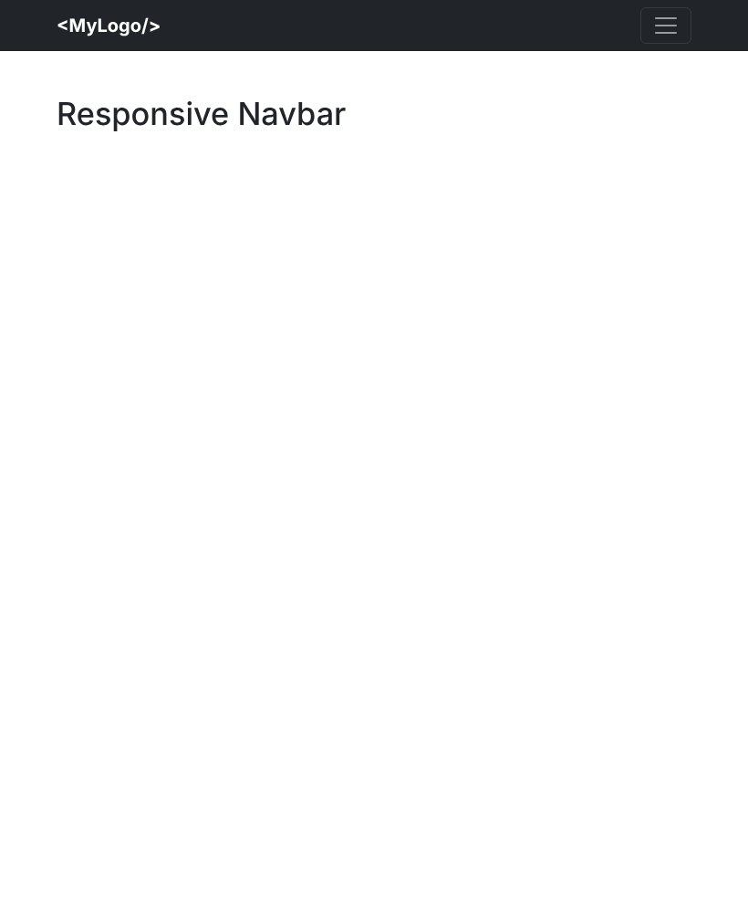

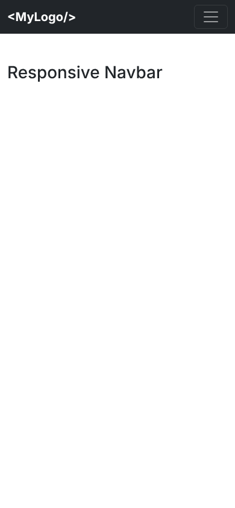

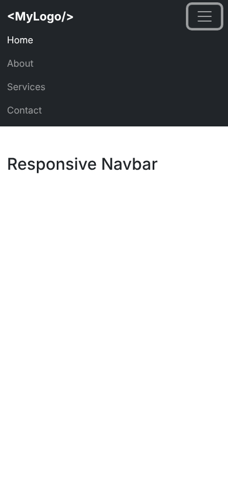

## Part 3. Combined Project

### Task 4. Responsive Portfolio Page

- Create a portfolio page using both Media Queries and Bootstrap Grid.
- Requirements:
  1. Header with a Bootstrap navbar.
  2. Main section divided into two parts:
     - Left side: portfolio projects (use Bootstrap grid to arrange cards).
     - Right side: sidebar with personal info and contact details.
  3. Footer across the bottom.
- Apply custom media queries to adjust font sizes, spacing, and element visibility for mobile, tablet, and desktop.
- Ensure that the page looks clean and usable across different screen sizes.

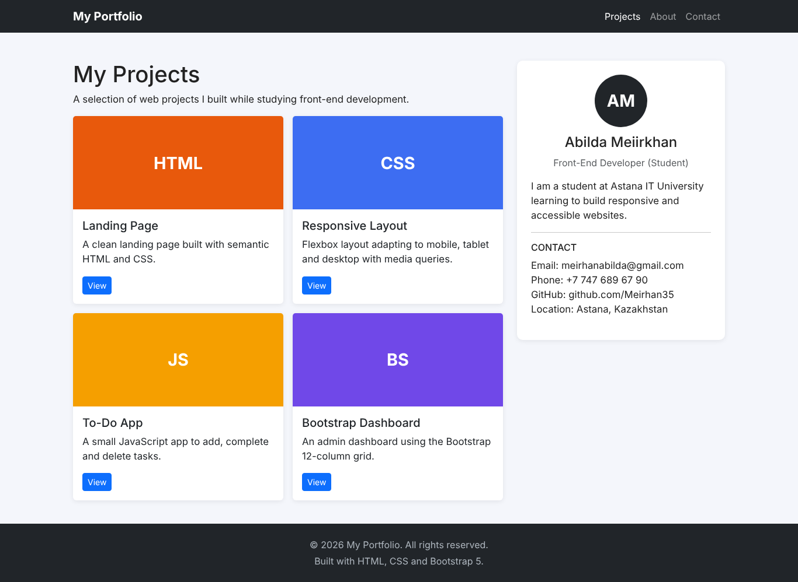

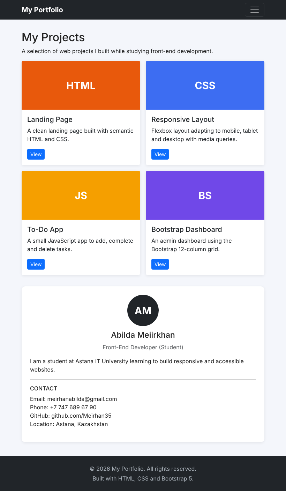

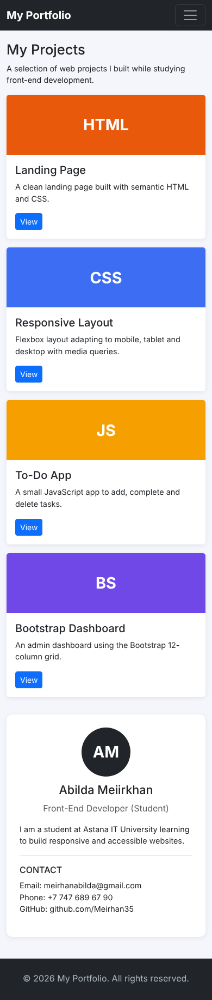

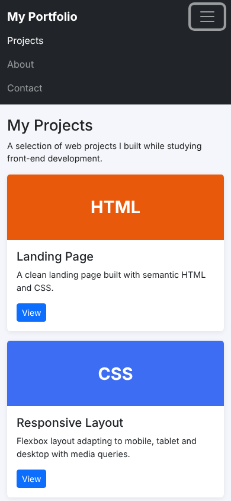

## Summary

I built each task in its own folder. Tasks 0 and 1 use CSS media queries for tablet and desktop breakpoints. Tasks 2 and 3 use the Bootstrap 12-column grid and navbar. Task 4 combines Bootstrap with custom media queries. I tested all pages at desktop, tablet and mobile widths and took the screenshots.
